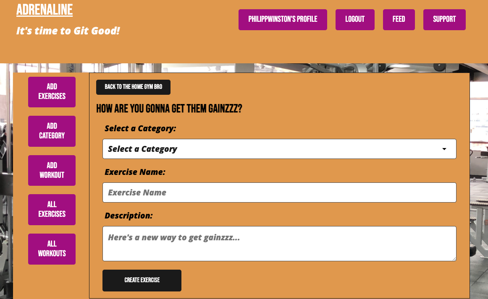

# Adrenaline
## *Your Workout Hub*
  
  
## [License](#license)

 is being used in this project, find out more about it here [License Info](https://opensource.org/licenses/MIT)

  ## [Description](#table-of-contents)
  
  We've all had that feeling you're at the gym you connect with somebody who's getting that great work out and you're inspired by them but, you don't know how to connect with them. Well those days are long over just introduced them and yourself to Adrenaline, your Workout Hub. This website aims to connect people who have insight on exercises I want to share them or people looking for inspiration for workouts and exercises to help them maintain a healthy lifestyle, work towards a personal goal, or even just a way to connect with new people in the exercise and fitness community.

  

  
  
  ## Table of Contents
  
  - [Description](#discription)
  - [Installation](#installation)
  - [Usage](#usage)
  - [Credits](#credits)
  
  - [Tests](#tests)
  - [License](#license)
  - [Questions](#questions)
  
  ## [Installation](#table-of-contents)
  
  After copying the repository into your workspace of choice, at the root level you will need to Open a Terminal and run `npm I` and then `npm run develop` this will start a local instance of the application for you to test. If you would like some preceded data you can run `npm run seed` to populate some workout categories and exercises.
    
  ## [Usage](#table-of-contents)
  
  Check out our page [Here](https://adrenaline-project3-6992473446fd.herokuapp.com/) to see the application in full force 

  
  ## [credits](#table-of-contents)
  
  Aven Pearson, Philipp Winston, Rojan Easo
  
  List your collaborators, if any, with links to their GitHub profiles.
  
  If you used any third-party assets that require attribution, list the creators with links to their primary web presence in this section.
  
  If you followed tutorials, include links to those here as well.

  Thank you for your interest in helping out; however, I will not be accepting contributions from third parties.
  

  

  ## [Tests](#table-of-contents)

  After copying the repository into your workspace of choice, at the root level you will need to Open a Terminal and run `npm I` and then `npm run develop` this will start a local instance of the application for you to test. If you would like some preceded data you can run `npm run seed` to populate some workout categories and exercises. You can then visit the populated link to sign up or sign in and then inject your own workouts, exercises, and categories. You can use mongo DB compass to see the database and structure.

  ## [Questions](#table-of-contents)

  Please contact me using the following links:
  - [Philipp's GitHub](https://github.com/Philippwinston)
  - [AvenP's GitHub](https://github.com/AvenP)
  - [robobrownie13](https://github.com/robobrownie13)
  - [Email Us](mailto:Philippwinston)
  
---
